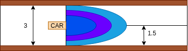

# Ejercicio 3---VFF

# Planteamiento
Programa un coche de Fórmula1, equipado con un sensor laser y un sensor GPS, para que recorra un circuito de carreras con valla en los laterales y con otros coches como obstáculos a lo largo del recorrido.

# 1. Desarrollo

Para abordar este ejercicio se desarrollaron varios módulos que trabajan de forma conjunta. El flujo general del programa se basa en:

1. Leer la posición actual del robot y la del objetivo.
2. Convertir los datos del láser en coordenadas cartesianas.
3. Calcular un vector repulsivo en base a los obstáculos.
4. Calcular un vector atractivo hacia el objetivo.
5. Fusionar ambos vectores para obtener el vector resultante de movimiento.
6. Aplicar control sobre las componentes X e Y para generar velocidades V y W.

## 1.1 El módulo **vectorial** 
Es el encargado de generar las fuerzas proporcionales que guían el movimiento del robot.

## 1.1.1 La fuerza atractiva
Se calcula aplicando la matriz de transformación sobre la posición objetivo y obteniendo un módulo que determina la distancia máxima hacia el punto deseado.

## 1.1.2 La fuerza repulsiva 
Transforma las mediciones del LiDAR en ángulos y, posteriormente, invierte sus valores para representar la dirección opuesta al obstáculo.
En este proceso se toma como referencia la distancia medida y se aplica la expresión exponencial
$$
mag = A \cdot e^{-k \cdot \frac{dist}{fac}}
$$
- `mag`: magnitud de la fuerza repulsiva resultante.  
- `A`: factor de escala que ajusta la intensidad máxima de la fuerza.  
- `k`: constante de decaimiento exponencial que controla la velocidad con la que disminuye la fuerza con la distancia.  
- `dist`: distancia entre el robot y el obstáculo detectado.  
- `fac`: factor angular dependiente del ángulo del rayo LiDAR, que aumenta la influencia de los obstáculos situados frente al robot.

Con esta última variable (`fac`) podemos regular la influencia de los muros y obstáculo laterales.

En la imagen se puede ver que el área de influencia de la fuerza repulsiva se ha definido según la distancia entre el centro de la carretera y los muros.
También se muestra el rango aproximado en el que actúa la repulsión.
Al usar una función exponencial, el coche puede acercarse más a los muros sin que la fuerza crezca demasiado rápido.
Gracias a esto, puede seguir una trazada más natural y mantener mayor velocidad en zonas donde no hay peligro de colisión.

Por último, limitamos el rango de la fuerza repulsiva.

## 1.1.3 La fusión de fuerzas
El objetivo es generar un vector que define la dirección y la velocidad del movimiento.
El vector resultante tiene que garantizar que se dirija a los objetivos esquivando los obstáculo.
Para lograrlo la suma resultante la divido entre el eje *X* (velocidad) y el eje *Y* (giro).

- **Eje X (velocidad):**  
  La componente atractiva domina este eje, ya que el coche debe seguir avanzando hacia el objetivo.  
  El vector repulsivo, aunque presente, tiene un peso menor (0.9 veces su valor) para evitar que las pequeñas detecciones del LiDAR provoquen frenadas bruscas o movimientos erráticos.  
  De esta forma, el coche mantiene una trayectoria fluida sin perder la dirección hacia la meta.

- **Eje Y (giro):**  
  En este eje se prioriza la **esquiva de obstáculos**, por lo que la influencia del vector repulsivo es mayor (se multiplica por 2).  
  Esto permite que el vehículo reaccione con rapidez ante objetos cercanos, ajustando el giro para evitar colisiones sin comprometer la estabilidad general del movimiento.

Antes de aplicar el vector resultante, el sistema incluye una comprobación de seguridad si las componentes atractiva y repulsiva se anulan mutuamente.
Esta comprobación es independiente del eje x de velocidad ya que usa los valores reales y comprueba que el eje Y tampoco sea 0, de esta forma garantiza que existe una ruta de movimiento.

## 1.2 El módulo **movimiento**
Es el encargado de transformar el vector resultante en velocidades para *V* y *W*

### 1.2.1 Control

Simplemente realizar ajustes para adecuar correctamente el paso de vector a velocidades usando PD para ambas situaciones.

### 1.2.2 Saturación y seguridad

Para evitar comportamientos bruscos o valores fuera de rango, se establecen límites:

- `MAX_V = 5` → velocidad lineal máxima.
- `MAX_W = 5` → velocidad angular máxima

Además, se impone una velocidad mínima (`v = max(0.5, min(MAX_V, v))`) que garantiza que el coche siga avanzando incluso cuando la atracción es débil, evitando quedarse bloqueado en zonas con fuerzas pequeñas o fluctuantes.

En caso de que el vector fusionado sea nulo (sin dirección ni magnitud), el sistema activa un modo de seguridad que detiene por completo el vehículo para prevenir movimientos indeterminados.

### 1.2.3 Detección de llegada al objetivo
La llegada al objetivo tiene una tolerancia igual al máximo del vector atractivo y repulsivo para garantizar que si se acerca en gran medida un objetivo a un obstáculo pueda completarlo.

## 2. Detalles y Vídeo

Como se ha mencionado anteriormente, la implementación del vector repulsivo permite que el vehículo realice una ligera trazada durante la conducción.  
Esta solución garantiza que el coche no colisione dentro de las condiciones del circuito actual.

No obstante, el rendimiento del sistema podría mejorar si el sensor LiDAR tuviera un rango de 360º o si el algoritmo contara con memoria temporal de las detecciones como por ejemplo un mapa local.  
Esto se debe a que, en situaciones como el instante 0:58 del vídeo, el vehículo puede acercarse demasiado a los obstáculos al intentar adelantar en zonas estrechas.  
En el algoritmo empleado actualmente la limitación de giro evita ese tipo de acercamientos extremos.

También es importante destacar la influencia de los objetivos intermedios.  
Por ejemplo, en el instante 0:51, el coche alcanza un nuevo objetivo situado justo al otro lado de una curva, lo que provoca que se acerque demasiado al muro y reduzca considerablemente su velocidad en una zona amplia.  
Este comportamiento muestra cómo la posición de los objetivos afecta directamente a la eficiencia de la trayectoria.

Finalmente, se observa que cuando los vehículos adelantados se encuentran suficientemente lejos, dejan de influir de manera significativa en las fuerzas repulsivas.  
Esto se traduce en menos frenazos y un movimiento más fluido, sin comprometer la seguridad del sistema. Un ejemplo se encuentar al final del video cuando adelanta a los dos últimos coches.

### Video:
<video width="640" height="360" controls>
  <source src="video/vff.mp4" type="video/mp4">
  Tu navegador no soporta el video.
</video>
