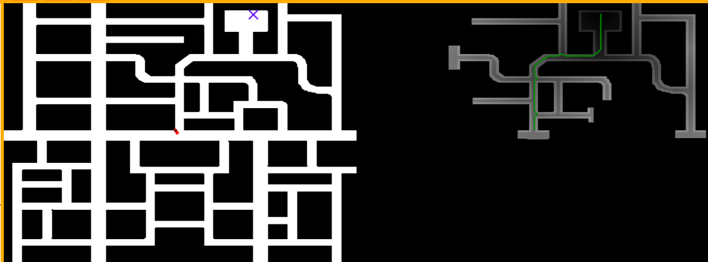
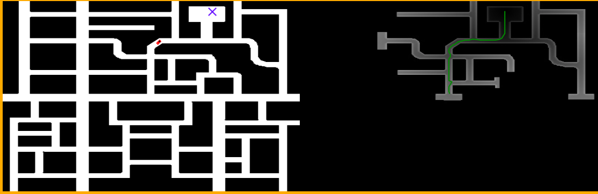

# Ejercicio 4 — GPP (Gradient Path Planning) con navegación reactiva

# Planteamiento

El objetivo de este ejercicio es implementar un sistema de navegación global para un vehículo autónomo capaz de:
- Generar un mapa de costes desde el objetivo hasta alcanzar la posición del coche, evitando obstáculos.

- Mostrar cómo sería la ruta de forma aproximada.

- Realizar control reactivo local que siga el gradiente de menor coste.

El sistema debe funcionar de forma continua, reaccionar ante nuevos objetivos y detectar de forma segura situaciones donde no se pueda avanzar hacia el objetivo.

# Desarrollo
## 1. Generación del campo de potenciales (State 0)

Para la planificación global se generó un campo de costes mediante busqueda en anchura (BFS) desde el objetivo hacia todo el mapa buscando el coche.

Los puntos clave del diseño fueron:

- Se usa una cola BFS que expande en 8 direcciones (4 ortogonales + 4 diagonales) guardando en memoría el coste anterior y sumano el movimiento.
- A partir del momento en el que encuentra el coche, se expanen ciertos nodos extra para permitir error de precisión y maniobrabilidad al coche.

Tras la expansión se realiza un engrosamiento de los obstáculos, añadiendo coste adicional inversamente proporcional a la distancia a los obstaculoso.
Este engrosamiento evita que la ruta se acerque demasiado a paredes y genera caminos más seguros y suaves.

## 2. Selección de objetivos (state 1 y 2)
En los estados 1 y 2, el sistema genera y selecciona el siguiente objetivo local que debe perseguir el robot.
Ambos estados comparten la misma lógica de evaluación del perímetro, cambiando únicamente el metodo y objetivo.

La selección del objetivo local fusiona el mapa de costes generado previamente con BFS y un perímetro alrededor de una posición del mapa (en el estado 2 el propio robot),
el objetivo es encontrar la posición con menor coste del perímetro.

Esto permite que el robot avance paso a paso hacia la meta global sin necesidad de calcular una ruta completa explícita.

El porqué de elegir solo el perímetro en vez de revisar todas las celdas dentro del radio se debe a dos factores:
1. Permite consistencia en el movimiento
2. Reduce el coste computacional

Hay que tener en cuenta la importancia de selecionar un radio adecuado, si es muy grande no aporta información útil, y si es muy pequeña proboca decisiones inconsistentes con la ruta deseada.

### 2.1 Generación del perímetro (cuadrado o rombo)

En un mundo cuadricular la selección de la figura influye directamente en la eficiencia del algoritmo.
En el proceso planteé dos formas:

- Perímetro cuadrado `max(|dx|, |dy|) = R`

Se obtienen todas las celdas a distancia Chebyshev del robot.

Incluye diagonales más alejadas en la misma capa lo que puede generar candidatos que no están exactamente a la misma distancia real provocando saltos poco naturales entre iteraciones.



Como se aprecia en la imagen, aunque la ruta lleve al objetivo, se generan movimientos inecesarios entrando a calles.
Esto es debido a que el movimiento basado en la distancia de Chebyshev se usa cuando quieres que todas las direcciones cuesten lo mismo.

- Perímetro en rombo `|dx| + |dy| = R`

Usa distancia Manhattan. Todas las celdas están basadas en distancia real lo que produce rutas más naturales.


El rombo representa una expansión uniforme donde cada movimiento está a la distancia efectiva del robot.

- El círculo

En una cuadrícula, un círculo tiene muy pocos puntos, especialmente para radios pequeños. Para mejorar esto hay que engordar el anillo probocando un rombo distorsionado.
Portanto aunque el circulo representa una geometría más natural en radios pequeños es menos efectivo que el rombo como se ve en:




En conclusión, para este ejercicio se ha decidido usar el rombo al ser opción más fiable en mapas discretos.


### 2.2 Selección del mejor candidato

Una vez calculadas las celdas del perímetro:
Se descartan muros y zonas consideradas peligrosas (coste inflado).
Entre las celdas restantes, se elige la de menor coste según la matriz de distancias.

Si el coste no mejora respecto al coste anterior el robot se detiene automáticamente:

```python
print("Blocked! You cannot safely approach the target")
```

Si el coste ya es muy cercano al objetivo se considera que el objetivo local está alcanzado:
```python
print("Goal reached!")
```

Esta lógica evita quedar atrapado en zonas de descenso brusco, cuellos estrechos o áreas amplificadas artificialmente.
Se considera que aparcar cerca de un obstaculo es dificil para la navegación actual, se podría implementar un algoritmo que apaque en paralelo al obstaculo cerca del objetivo.

### 2.3 Relación entre state 1 y state 2

State 1: Genera una ruta que permite visualizar una aproximación del movimiento esperado.

State 2: Selecciona continuamente el siguiente punto local a seguir.

Ambos estados usan el mismo mecanismo de selección por perímetro, por eso las imágenes explican tanto el estado 1 como el 2.

## 3. Control PID de V y W

Sirve para calcular la V y W en función del ángulo y la distancia al objetivo generano el movimiento de forma suave.

## 4. Integración final del sistema

El bucle principal gestiona los estados:

State 0: recalcula el campo si hay un nuevo objetivo.

State 1: genera una ruta aproximada (solo visual).

State 2: navegación reactiva con PID y detección de bloqueo.

El sistema vuelve a State 0 automáticamente al alcanzar el objetivo o ante una situación de bloqueo.

## 5. Problemas detectados y soluciones aplicadas

1. Interpretación del mapa y coordinación x–y

Debido a que WebGUI usa formato (columna, fila) y las matrices usan (fila, columna), se hizo necesario unificar este comportamiento en todos los módulos.

2. Zona de seguridad alrededor de obstáculos

El aumento de coste alrededor de vallas se ajustó para evitar caminos demasiado cercanos que provocaban oscilaciones o decisiones no óptimas.

## 6. Resultado

<video width="640" height="360" controls>
  <source src="video/p4_gpp.mp4" type="video/mp4">
  Tu navegador no soporta el video.
</video>

En el video se comprueba que independientemente del estado del robot se puede asignar otro punto objetivo así como se garantiza que funcióna el movimiento.
