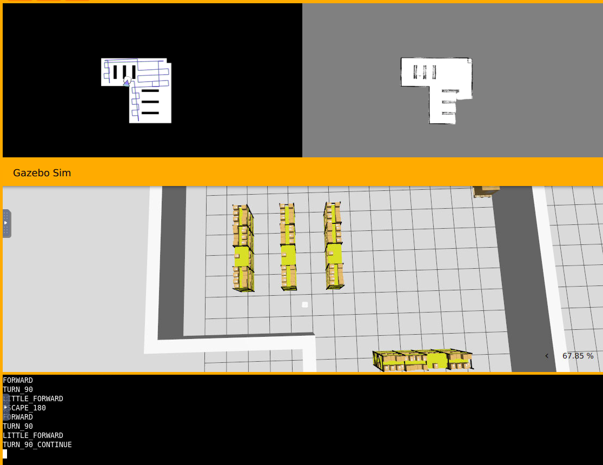
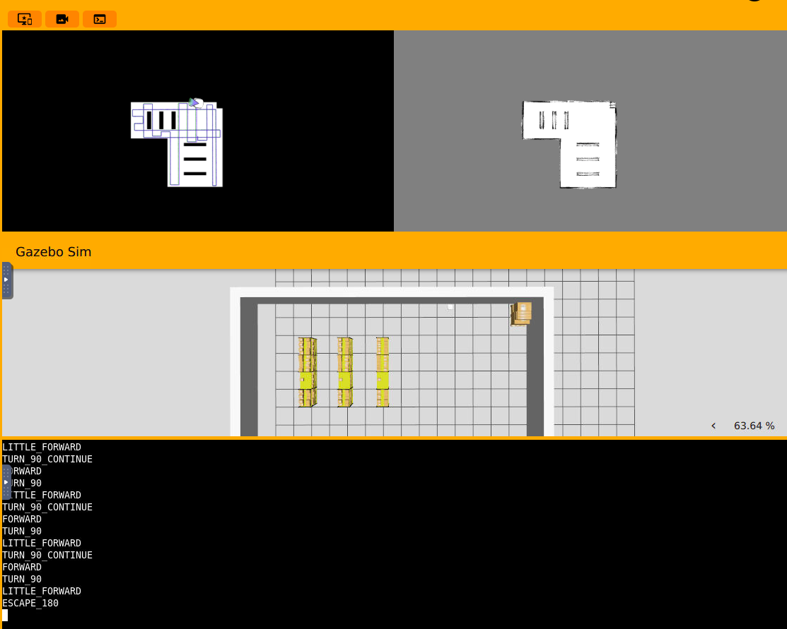
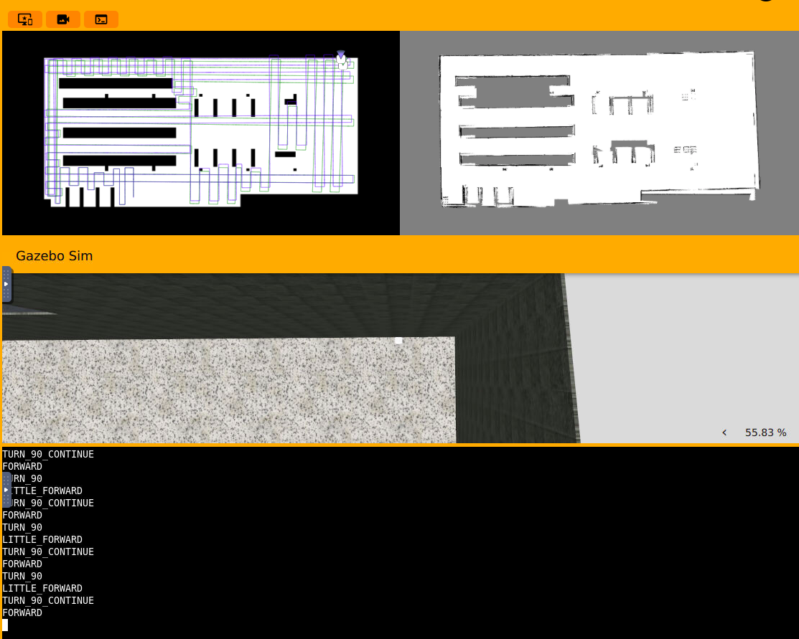
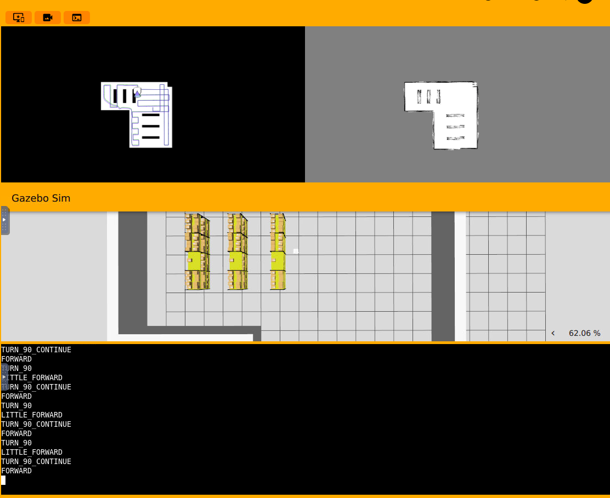
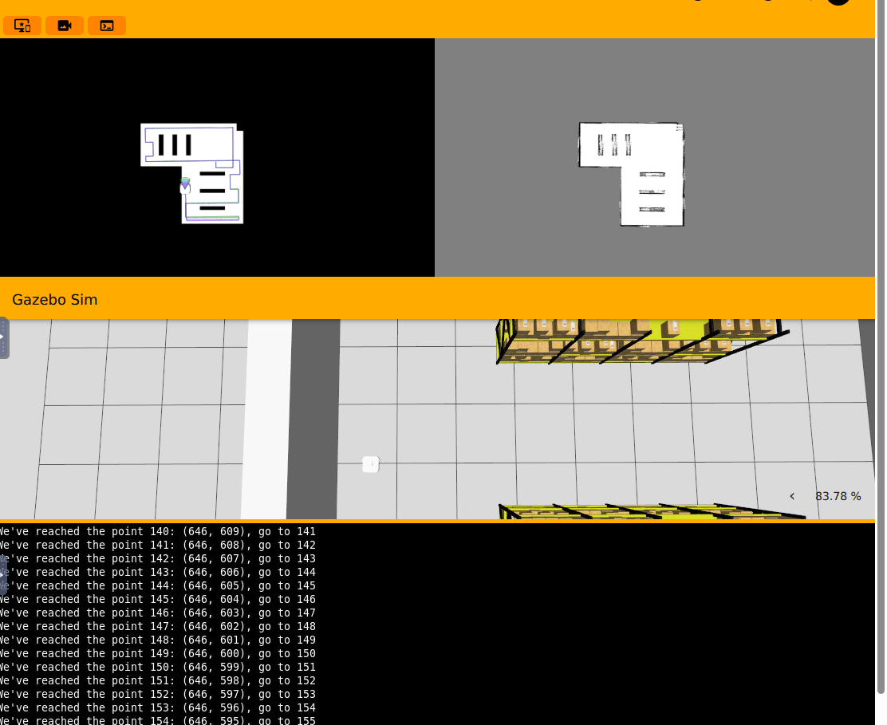
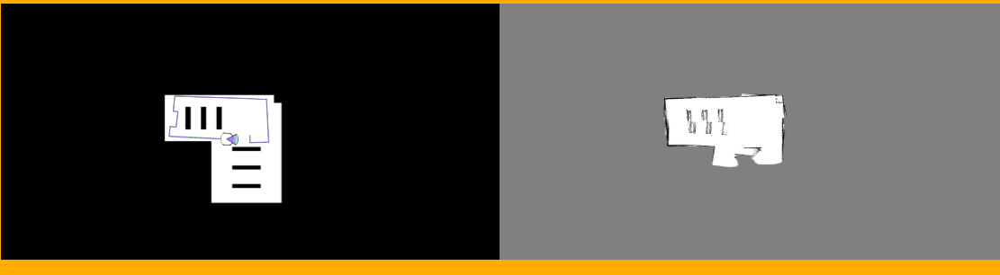
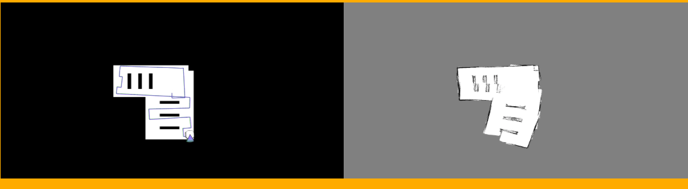
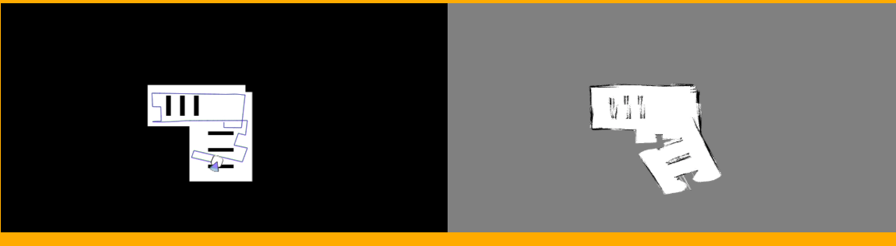

# Robot de Mapeo Probabilístico en P5

Este proyecto implementa un robot autónomo equipado con sensor láser y autolocalización para explorar y mapear una nave industrial, generando un mapa de ocupación probabilístico en forma de rejilla.

# Objetivo

El robot debe:

- Explorar de manera autónoma todo el entorno, visitando zonas desconocidas.

- Construir un mapa probabilístico basado en las lecturas del sensor láser y la posición estimada por el sistema de autolocalización.

- Visualizar el mapa actualizado en tiempo real.

## Mapeo probabilístico

El robot mantiene un gridmap en el que cada celda representa un área del entorno y su probabilidad de estar ocupada. Para actualizar las celdas, se implementa:

- Modelo de sensor: La probabilidad de ocupación a partir de la observación, 
```𝑝(ocupada∣obs(𝑡))p(ocupada∣obs(t))```, cada lectura del láser se traduce en celdas libres o ocupadas usando Ratios de probabilidad (log-odds).
Esta combinación de evidencias con Bayes esta limitada por -1 a 254 de tal forma que <= 0 es espacio libre y >=1 es espacio ocupado, el valor acumulado de los espacios libres es menor para adaptarse a cambios del entorno más rápido.

- Mediciones condicionadas al movimiento: el robot solo actualiza el mapa si se ha desplazado o girado lo suficiente desde la última medición, evitando redundancia y reduciendo el error acumulado.

- Algoritmo de Bresenham: se utiliza para trazar la línea entre el robot y el punto detectado por el láser, marcando como libres las celdas por las que pasa el rayo y como ocupadas las celdas donde detecta un obstáculo.
A esto se le suma que se usa el rango máximo del laser para delimitar zonas libre.

Esta estrategia permite construir un mapa robusto incluso con sensores imperfectos, aunque la calidad del mapa se ve afectada si la autolocalización tiene mucho ruido. No funciona bien con Odom2 y Odom3

## Algoritmo de exploración y movimiento

La navegación del robot se organiza en dos partes principales:

1. Barrido automático:

El robot avanza mientras el frente está libre. Al encontrar un obstáculo, gira 90° y avanza un tramo corto antes de continuar, creando un patrón de exploración tipo zigzag. El tramo corto debe ser menor sin el apartado 2.
Este comportamiento permite cubrir grandes zonas de manera sistemática y evitando el ruido de forma efectiva.

2. Búsqueda de zonas desconocidas:

Cuando el robot se encuentra en una posición sin salidas libres o zonas por explorar, utiliza una estrategia de búsqueda basada en celdas seguras no exploradas.
Se calcula una ruta hacia estas zonas utilizando A* sobre el gridmap probabilístico, evitando obstáculos conocidos y manteniendo un margen de seguridad.
Una vez alcanzada la zona, se retoma el patrón de barrido.

Este enfoque combinado garantiza que el robot pueda cubrir todo el entorno de manera eficiente, evitando quedarse atrapado y maximizando la información recolectada para el mapa.

El algoritmo A* puede dar problemas en la escalabilidad, es por esto que he tenido que limitarlo. Esto se debe a que la ruta tiene que garantizar que puede pasar el robot almenos en las zonas ya mapeadas.

# Observaciones y pruebas
Los puntos del 1 al 3 se explican con Odom normal.

## 1. Precisión
En este proyecto se observó que mayor margen de error en el giro y velocidades altas pueden provocar desviaciones en la posición estimada, generando inconsistencias en el algoritmo de barrido y arrastrando un mayor error.



## 2. Barrido automático
Inicialmente, el robot solo implementaba el barrido automático con un mecanismo de escape basado en un giro de 180°. Sin la búsqueda de zonas desconocidas, los resultados fueron:





Esto permitió cubrir parte del entorno, pero dejaba zonas inaccesibles o no exploradas, lo que motivó la incorporación de la estrategia de búsqueda de zonas desconocidas.

# 3. Movimientos posibles en A*
Al principio se permitieron movimientos diagonales dentro del algoritmo de búsqueda A*, lo que otorgaba mayor libertad y rutas más cortas, pero aumentaba la posibilidad de errores acumulativos debido a la odometría, especialmente en entornos grandes:

- Imagen 1: Movilidad completa hacia celdas adyacentes y diagonales. La ruta planificada (verde) puede desviarse respecto a la posición estimada (azul) si hay errores en la odometría.

- Imagen 2: Movimientos restringidos a las 4 celdas adyacentes (0,1), (1,0), (0,-1), (-1,0). La línea verde y la azul se mantienen juntas, reduciendo desviaciones y haciendo el seguimiento más robusto, aunque limitando la flexibilidad de la ruta. Tambien se aprecia que se usa un mayor movimiento en la secuencia de desplazamiento de barrido lo que optimiza esta función.





# 4. Odom 2 y 3
El rendimiento del mapeo depende en gran medida de la precisión de la autolocalización. Al usar sistemas con mayor ruido, como HAL.getOdom2 y HAL.getOdom3, se observan efectos significativos en el mapa:

- ```Odom2```: Las dos primeras imágenes muestran cómo la imprecisión de la odometría distorsiona el mapa, sobreescribiendo posiciones correctas de obstáculos,
como la estantería central, en relación con la posición real del robot.





- ```Odom3```: Con aún mayor ruido, los errores se acentúan y el mapa se vuelve menos confiable, mostrando deformaciones más grandes.



# 5. Mapa grande.
En entornos muy grandes, el cálculo de rutas con el algoritmo A* puede volverse costoso, especialmente cuando debe evaluar muchas posiciones para llegar a zonas desconocidas.

Por esta razón, no se ha completado una muestra del mapa grande, ya que el sistema se queda colgado durante el cálculo de la ruta.

Esto evidencia una limitación práctica del enfoque actual y sugiere que, para mapas de gran tamaño, sería necesario optimizar la planificación de rutas o usar técnicas de búsqueda más eficientes.

## Sugerencia de mejora con nodos agrupados

- Dividir el mapa en conjuntos de nodos(cuadrados de nxn pixeles), donde cada nodo está enlazado con sus vecinos a 0°, 90°, 180° y -90°.  
- Planificar la ruta inicial sobre estos conjuntos, priorizando aquellos que sean accesibles y contengan un **porcentaje significativo de pixeles desconocidos**.  
- Realizar barridos por conjuntos evitando giros innecesarios.  
- La ruta se actualiza dinámicamente al encontrar paredes u obstáculos, asegurando que siempre se explore zonas desconocidas y accesibles.  

Beneficios de esta estrategia:

- Reducir el coste computacional de la planificación de rutas en mapas grandes.  
- Evitar bucles infinitos o cálculos excesivos.  
- Garantizar que la **exploración sea completa y eficiente** incluso en entornos amplios.

# Video
En el video se aprecia el barrido y el funcionamiento del caso de escapar de una situación dificil mientras busca zonas no exploradas.

<video width="640" height="360" controls>
  <source src="video/p5.mp4" type="video/mp4">
  Tu navegador no soporta el video.
</video>
